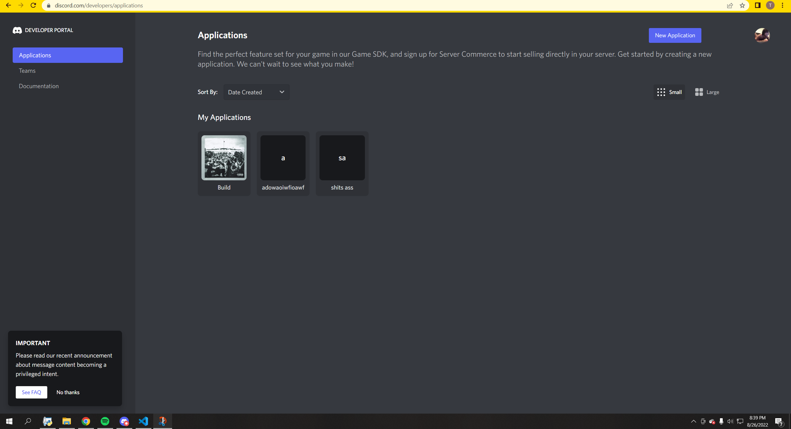
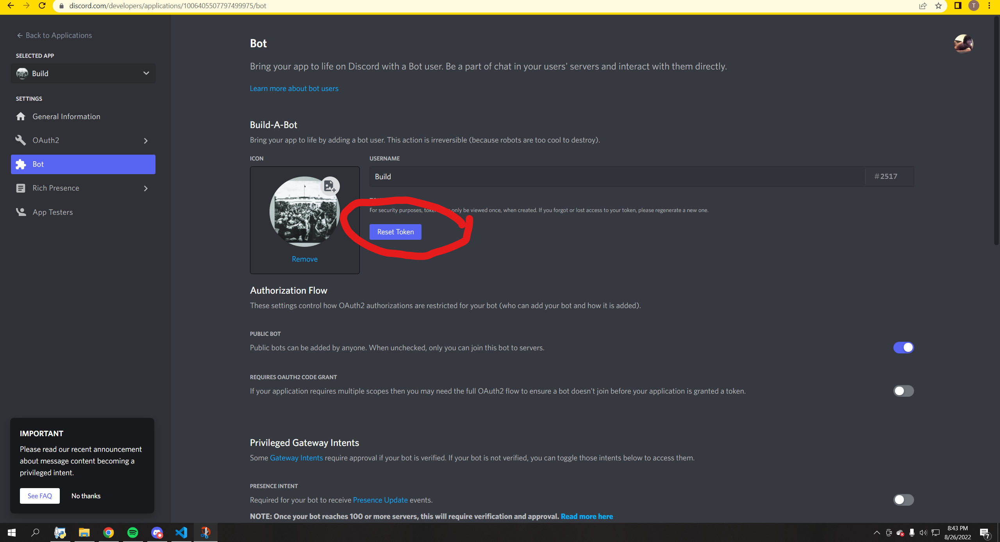
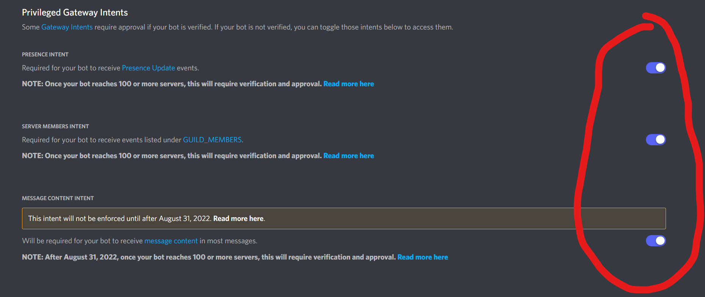
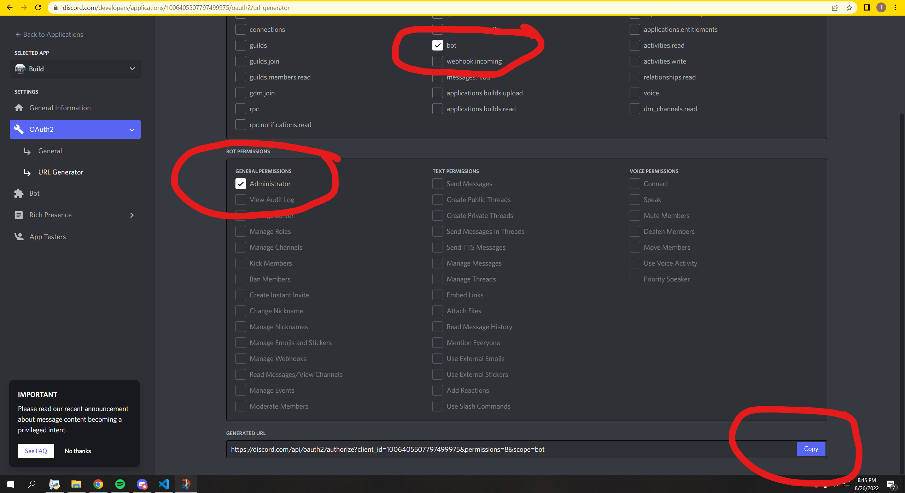

# Somali Nuker

Somali Nuker is probably the fastest discord nuker that is free. (probably because idk tbh)

Not only is it a nuke bot it also spams prn(9k image database lol), ban all command, kick all command, massdm command (CAN BE USED FOR ADVERTISING TOO!!!), and is just cool! 

# How to use

## step 1.) 

Press the green code button and press download zip

## step 2.) 

Go to this [link](https://discord.com/developers/applications) and press new application as seen in the picture 


## step 3.)



## step 4.)



## step 6.)



copy link and paste it in browser to invite bot!
## step 7.)

Change the bot token and other configs

## step 8.) 

run setup.bat and say god help in the same server the bot is in for the help menu

## Config

```python
TOKEN = '' #ur BOT token here
CHANNEL_NAMES = 'K.Dot#0001' #name of the created channels
MESSAGE = '@everyone K.Dot#0001 was here! ' #message u want ALSO make sure there is a space at the end if your using spam_prn
PREFIX = 'god ' #ur prefix
AMMOUNT_OF_CHANNELS = 30 #lol you can go more if u got a good pc
SERVER_NAME = 'KDot better' #mad facts cuz
SPAM_PRN = True #hehehehehehehehehehe
PROXIES = False #no proxies is a LOT faster but u can get ratelimited faster sometimes so its up to u ALSO PROXIES WILL MESS UP CONSOLE LMAO
LESS_RATE_LIMIT = False #TURN TO TRUE IF YOU WANT TO GET RATE LIMITED LESS. PROXIES IS STILL BETTER THO
```

## Contributing

PLEASE MAKE PULL REQUESTS IF YOU THINK YOU CAN ADD OR FIX SOMETHING!!!

# Still need help?

here is my [server](https://discord.gg/3ZqvaCz6zj) just join and let us know if u got any questions!

## License
[MIT](https://choosealicense.com/licenses/mit/)

## Final Message

I made this project because my dad originated from somalia and I think he is a good man.

FINAL STEP

NEVER click worms and listen to [this](https://open.spotify.com/album/4eLPsYPBmXABThSJ821sqY?si=319c89f639594af7)
